#  Домашнее задание по TeamCity

##  Описание
Настройка CI/CD пайплайна с использованием **TeamCity**, **Nexus** и **Yandex Cloud**.
Реализована автоматическая сборка, тестирование и деплой Java-приложения.

---

##  Используемый стек
- **TeamCity** — CI/CD сервер 
- **Nexus** — менеджер артефактов 
- **Maven** — сборка проекта 
- **Java 8** — язык программирования 
- **Yandex Cloud** — облачная инфраструктура 

---

##  Что было сделано
- Созданы 3 VM в Yandex Cloud (TeamCity Server, TeamCity Agent, Nexus) 
- Настроен TeamCity Server и авторизован агент 
- Создан проект на основе форка репозитория 
- Настроены условия сборки: 
  - `master` → `mvn clean deploy` (деплой в Nexus) 
  - `feature/*` → `mvn clean test` (только тесты) 
- Загружен `settings.xml` с кредами для Nexus 
- Изменен `pom.xml` для деплоя в Nexus 
- Создана ветка `feature/add_reply` с методом, содержащим слово **hunter** 
- Добавлен тест на поиск слова **hunter** 
- Ветка влита в `master` через Merge 
- Настроены артефакты сборки (`target/*.jar`) 
- Конфигурация TeamCity мигрирована в репозиторий (Kotlin DSL) 

---

##  Скриншоты выполнения

###  Список виртуальных машин в Yandex Cloud  
**Описание:** Показаны 3 запущенные VM: `teamcity-server`, `teamcity-agent`, `nexus-vm`. Все имеют внешние IP и статус `RUNNING`.  
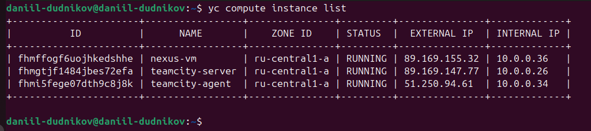

---

###  Главная страница TeamCity  
**Описание:** Виден созданный проект `Create project` и успешные сборки. Артефакты сборки отображаются в интерфейсе. 
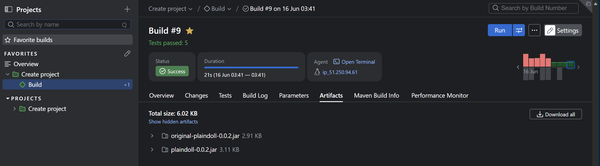

---

###  Подключенный агент  
**Описание:** Агент с именем `ip_51.250.94.61` успешно авторизован и находится в статусе `Connected`. Готов к выполнению сборок.  
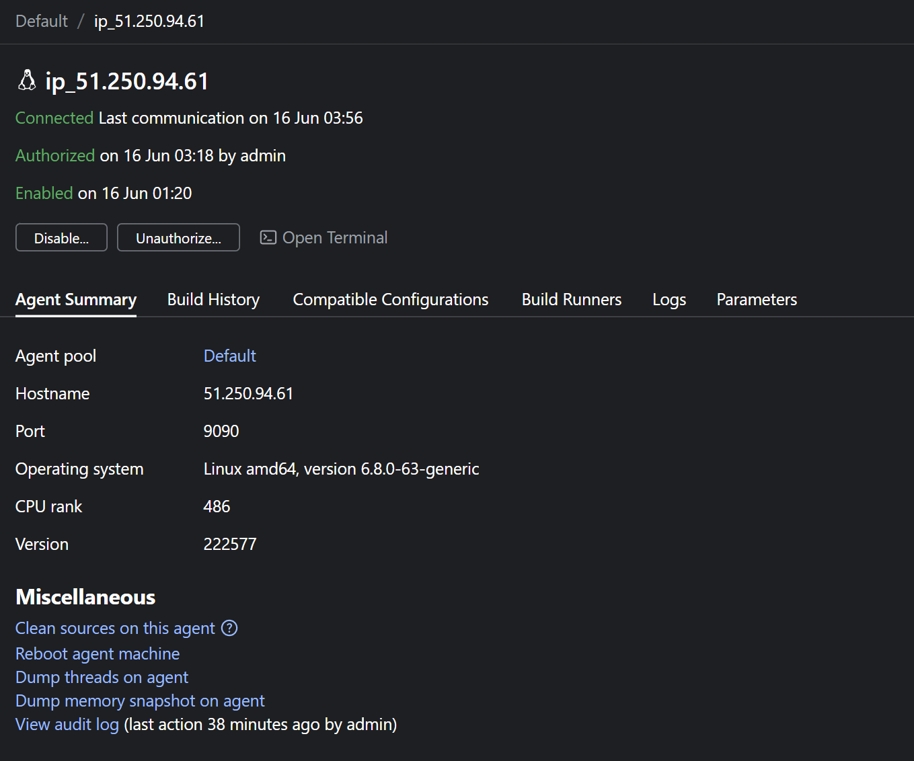

---

###  Шаги сборки (общий вид)  
**Описание:** В проекте настроены 2 шага: `Maven test for feature branches` и `Maven build`. Каждый шаг имеет свои условия выполнения.  
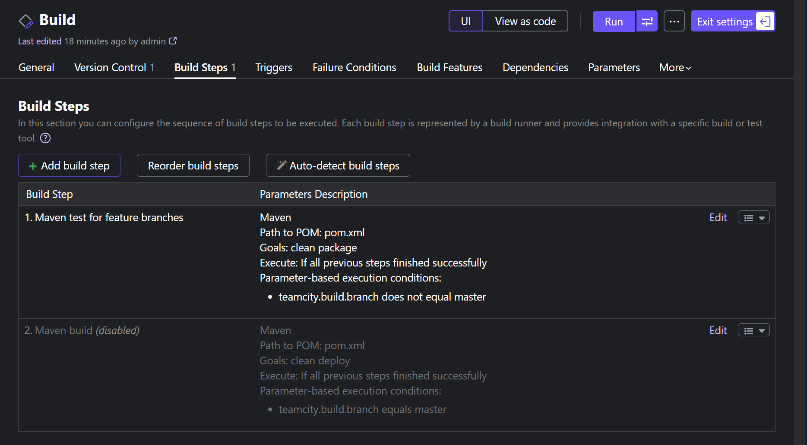

---

###  Условия для сборок (feature / master)  
**Описание:** Настроены условия выполнения:
- Для `feature/*` → `clean package`
- Для `master` → `clean deploy` 
Это гарантирует, что в мастер деплоятся артефакты, а в фича-ветках только тесты. 
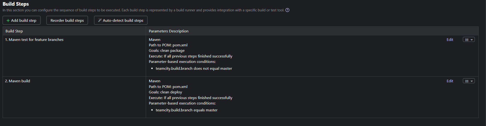

---

###  Собранные артефакты (jar-файлы)  
**Описание:** После сборки в артефактах появились `plaindoll-0.0.2.jar` и `original-plaindoll-0.0.2.jar`. Артефакты опубликованы в TeamCity.  
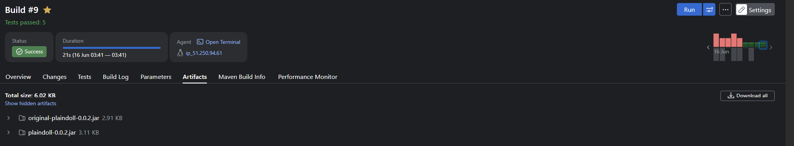

---

###  Nexus — главная страница  
**Описание:** Nexus успешно запущен и доступен по адресу `http://89.169.155.32:8081`. Видна панель управления и уведомления.  
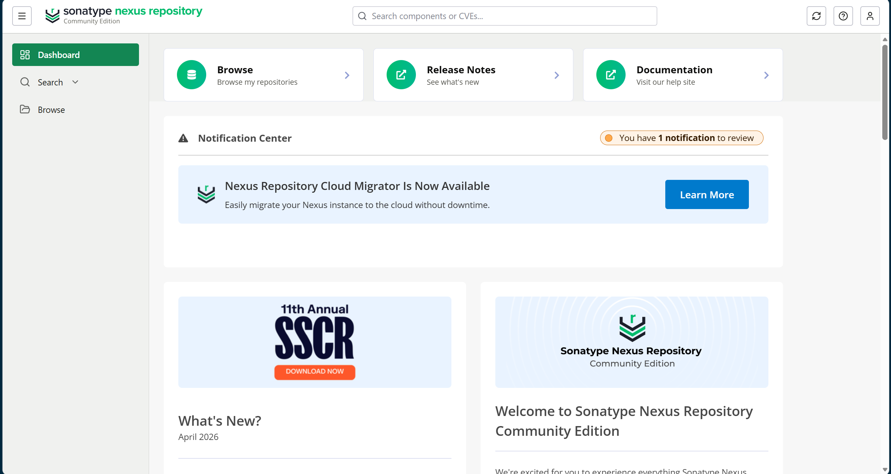

---

###  Артефакт в Nexus (maven-releases)  
**Описание:** В репозитории `maven-releases` появился артефакт `plaindoll-0.0.2.jar`. Это подтверждает успешный деплой из TeamCity.  
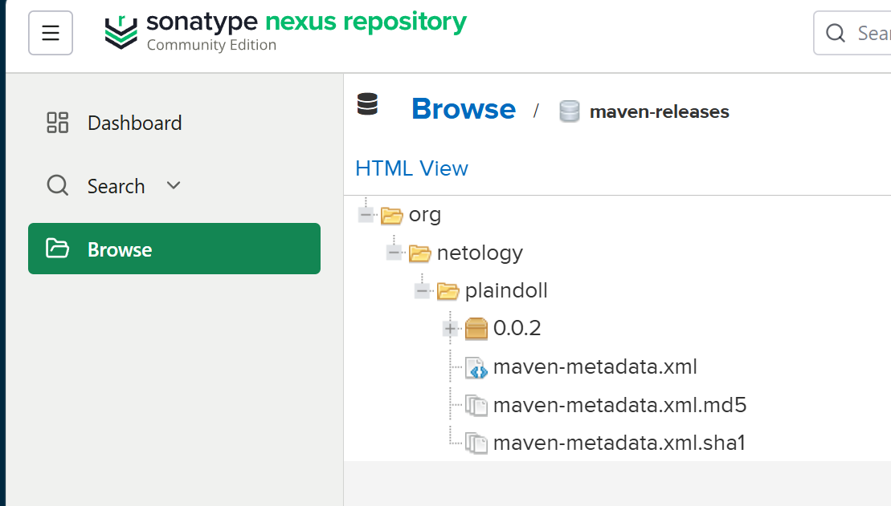

---

###  Успешная сборка ветки `feature/add_reply`  
**Описание:** Сборка #10 выполнена для ветки `feature/add_reply`. Все 6 тестов пройдены успешно. Метод с репликой "hunter" работает корректно.  
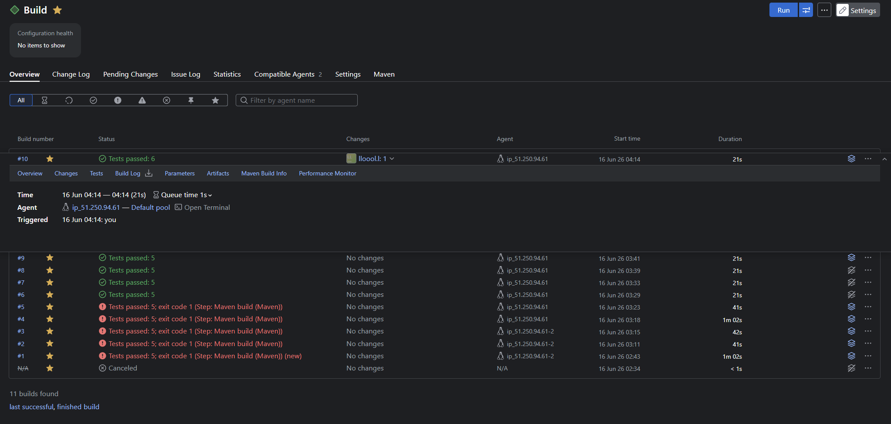

---

###  Слияние `feature/add_reply` → `master`  
**Описание:** Ветка `feature/add_reply` успешно влита в `master`. Коммит `9d5339a` содержит изменения: добавлен метод `getHunterReply()` и тест для него.  
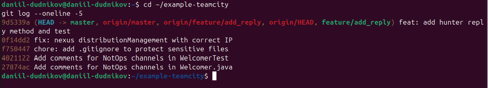

---

##  Структура проекта

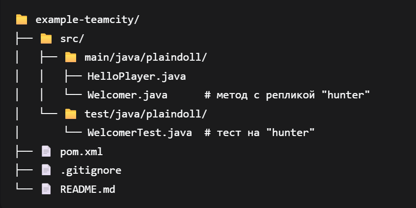
